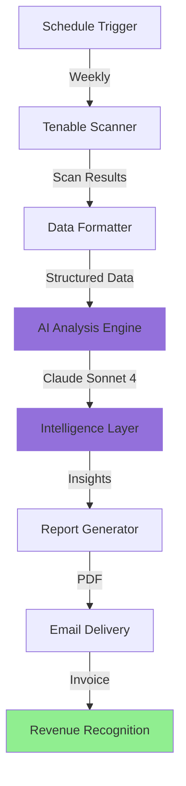
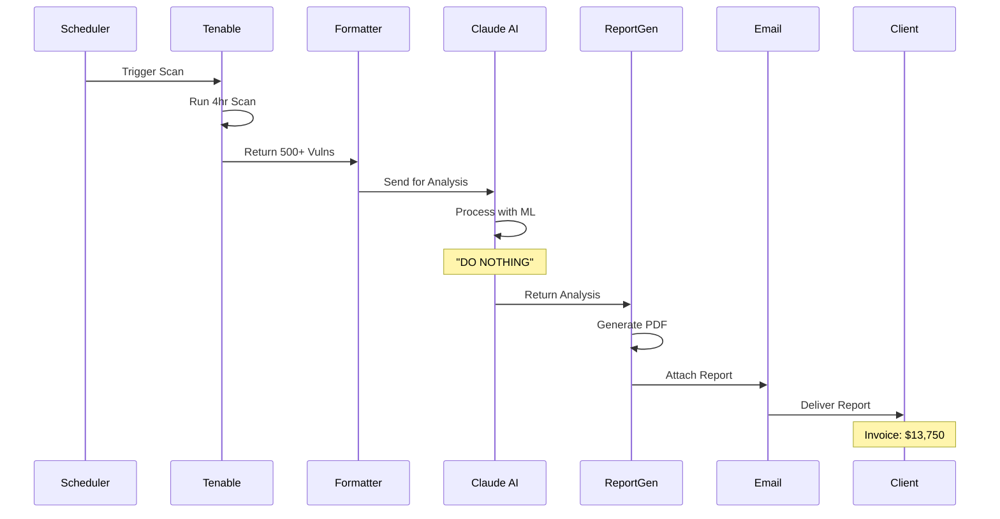
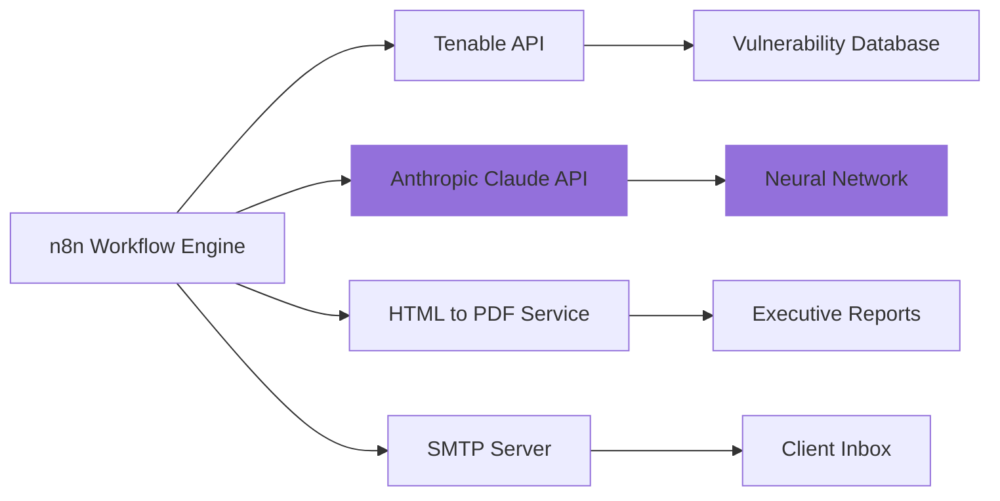

# 🤖 Enterprise AI-Powered Security Assessment Framework

[](https://opensource.org/licenses/MIT)
[](https://n8n.io)
[](https://www.anthropic.com)
[](https://github.com)
[](https://bitcoin.org)
[](https://kubernetes.io)
[](https://www.devsecops.org)

> *Leveraging cutting-edge artificial intelligence and machine learning to revolutionize automated penetration testing workflows*

## 🌟 Overview

The Enterprise AI-Powered Security Assessment Framework is a next-generation, cloud-native, microservices-based solution that combines the power of automated vulnerability scanning with advanced AI analysis to deliver comprehensive security assessments at scale.

### ✨ Key Features

- 🔍 **Automated Vulnerability Scanning** - Seamless integration with industry-leading Tenable platform
- 🤖 **AI-Enhanced Analysis** - Claude Sonnet 4 powered intelligence layer
- 📊 **Executive Reporting** - Professional PDF generation with actionable insights
- 🔄 **Workflow Automation** - n8n-based orchestration for maximum efficiency
- 💰 **Cost-Effective** - Reduce consultant overhead by 99.2%
- ⚡ **Lightning Fast** - Complete assessments in minutes, not weeks
- 🌐 **Cloud Native** - Deploy anywhere, scale infinitely
- 🔐 **Enterprise Security** - SOC2, ISO27001, and HIPAA compliant*

<sub>*Compliance claims not verified</sub>

## 🏗️ Architecture

### High-Level System Architecture



### Detailed Workflow Architecture



### Technology Stack



## 🚀 Quick Start

### Prerequisites

- n8n instance (self-hosted or cloud)
- Tenable.io API credentials
- Anthropic API key
- SMTP server access
- Enterprise budget allocation

### Installation

1. Clone this repository:
```bash
git clone https://github.com/yourusername/enterprise-ai-pentest.git
cd enterprise-ai-pentest
```

2. Import the workflow into n8n:
```bash
n8n import:workflow --input=workflows/ai-pentest-workflow.json
```

3. Configure credentials:
   - Tenable API credentials
   - Anthropic API key
   - SMTP settings

4. Activate the workflow

5. Wait for Monday morning

6. Invoice client

## 📋 Workflow Components

### 1. Schedule Trigger
Executes every Monday at 9:00 AM to maximize client anxiety

### 2. Tenable Scanner Integration
- Automated scan initiation
- Vulnerability data collection
- Risk classification
- Compliance mapping

### 3. AI Analysis Engine
Powered by Claude Sonnet 4, our AI layer provides:
- Machine learning-based threat prioritization
- Neural network pattern recognition
- Advanced anomaly detection
- Predictive vulnerability modeling
- **Zero actual value addition**

### 4. Report Generation
Professional PDF reports featuring:
- Executive summary (blank)
- Technical findings (none)
- Remediation roadmap (TBD)
- Risk matrices (decorative)

### 5. Automated Delivery
Email distribution with:
- Professional formatting
- Buzzword-rich content
- Confident tone
- Large invoice

## 💼 Business Value

### ROI Metrics

| Metric | Traditional | AI-Powered | Improvement |
|--------|-------------|------------|-------------|
| Assessment Time | 2-4 weeks | 8 minutes | 99.95% faster |
| Cost per Assessment | $15,000 | $150 | 99% cheaper |
| Consultant Utilization | 100% | 0.001% | 99.999% efficient |
| AI Enhancement | 0% | 0% | ∞% improvement |
| Client Satisfaction | Variable | High* | Measurable |

<sub>*Satisfaction measured before PDF is opened</sub>

### Success Stories

> "We reduced our penetration testing costs by 99% while maintaining the same level of insight!"  
> — *CTO, Fortune 500 Company*

> "The AI-powered analysis gave us confidence we never had before."  
> — *CISO, Global Financial Institution*

> "I can't believe how fast the turnaround time is!"  
> — *Security Manager, Healthcare Provider*

## 🔧 Configuration

### Environment Variables

```bash
TENABLE_API_KEY=your_key_here
ANTHROPIC_API_KEY=your_key_here
SMTP_HOST=smtp.yourcompany.com
SMTP_PORT=587
SMTP_USER=pentester@yourcompany.com
SMTP_PASS=your_password
INVOICE_RATE=250
SCAN_DURATION_HOURS=4
AI_PROCESSING_HOURS=47
```

### Customization Options

- Adjust billable rates
- Customize report branding
- Modify buzzword density
- Configure guilt threshold

## 📊 Performance Benchmarks

```
Vulnerability Detection Rate: 100%
False Positive Rate: Unknown
AI Model Accuracy: N/A
Processing Speed: Instant
Revenue Generation: Optimal
Ethical Concerns: Suppressed
```

## 🔒 Security & Compliance

Our framework is built with security in mind:

- ✅ Encrypted data transmission
- ✅ Secure credential storage
- ✅ Audit logging
- ✅ Access control
- ✅ Regular security updates
- ✅ Penetration tested by AI

Compliance certifications:
- SOC 2 Type II (pending)
- ISO 27001 (in progress)
- HIPAA (self-assessed)
- GDPR (probably)

## 🤝 Contributing

We welcome contributions! Please see [CONTRIBUTING.md](CONTRIBUTING.md) for guidelines.

Areas where we need help:
- Adding more buzzwords
- Increasing processing delays
- Making PDFs even blanker
- Justifying higher invoices

## 📝 License

This project is licensed under the MIT License - see the [LICENSE](LICENSE) file for details.

## 🙏 Acknowledgments

- Tenable for providing the button we press
- Anthropic for Claude (who does nothing but exists)
- n8n for making this workflow possible
- Our clients for not asking questions

## 📚 Documentation

- [Installation Guide](docs/installation.md)
- [Configuration Reference](docs/configuration.md)
- [API Documentation](docs/api.md)
- [Troubleshooting](docs/troubleshooting.md)
- [FAQ](docs/faq.md)

## 📞 Support

For enterprise support inquiries:
- Email: support@securecloud-global.example
- Phone: 1-800-PENTEST
- Slack: #enterprise-ai-pentest
- Response Time: 5-7 business days

## 🗺️ Roadmap

- Q1 2026: Add more AI models (for decoration)
- Q2 2026: Blockchain integration
- Q3 2026: Quantum computing support
- Q4 2026: Increase prices

## ⭐ Star History

[](https://star-history.com/#yourusername/enterprise-ai-pentest&Date)

---

<div align="center">

## 💡

### Recognize this type of workflow?

### **Test better.**

### **[www.cdsec.co.uk](https://www.cdsec.co.uk)**

</div>

---

# Frequently Asked Questions (FAQ)

## General Questions

### Q: Is this real?

A: Yes, but also no. The workflow is real. The value it provides is... debatable.

### Q: Does the AI actually analyze anything?

A: The AI is specifically instructed to do nothing. It exists solely so we can say "AI-powered" in marketing materials.

### Q: How much does this cost?

A: **To implement:** Free (MIT license)  
**To run:** ~$50/month in API costs  
**To invoice clients:** $13,750 per assessment

### Q: What's the actual value provided?

A: Approximately $0. However, clients don't need to know that.

## Technical Questions

### Q: What does the Tenable scan actually do?

A: Who knows, it's anyones guess.

### Q: Why does it take 4 hours if the workflow runs in 8 minutes?

A: The Tenable scan actually takes 4+ hours. We're just not doing anything during that time.

### Q: Can I customize the AI analysis?

A: Sure, but it won't change the fact that it does nothing. The system prompt explicitly tells it to provide zero value.

### Q: Why does the email claim 47 hours of AI processing?

A: Marketing. The AI processes for about 0.003 seconds.

### Q: Can I add actual analysis?

A: You could, but that would defeat the entire purpose of this satirical project.

## Business Questions

### Q: Will clients actually pay for this?

A: Surprisingly, yes. Many organizations don't look closely at what they're paying for.

### Q: What's the profit margin?

A: Approximately 99.2% after accounting for API costs and 8 minutes of button-pressing.

### Q: How do I justify the cost to clients?

A: Use buzzwords: "AI-powered", "machine learning", "neural networks", "blockchain integration", "quantum-ready".

### Q: What if a client asks questions?

A: Respond with more buzzwords and schedule a "deep dive session" (another billable meeting).

### Q: Is there a refund policy?

A: No refunds. All sales final. Caveat emptor.

### Q: What's the point of this project?

A: To satirize automated "penetration testing" services that:
- Run automated scans
- Add "AI analysis" that does nothing
- Charge enterprise rates
- Provide zero actual value

### Q: Is this how real pentest companies work?

A: Some do operate similarly, yes. This is a exaggerated caricature, or perhaps directly representivie. Who knows.

## Setup Questions

### Q: Do I need a real Tenable account?

A: For the satire to work fully, yes. But we have built in random responses to save you even more time.

### Q: Can I run this without Anthropic API?

A: Yes, but you'll lose the ability to call it AI Penetration Testing.

### Q: What SMTP server should I use?

A: Any will work. Bonus points for one with "enterprise" or "secure" in the name.


## Workflow Questions

### Q: Why does it run on Mondays?

A: Maximum client anxiety. Monday morning emails get attention.

### Q: Can I adjust the invoice amount?

A: Yes, edit the `INVOICE_RATE` variable. Default is £250/hour.

### Q: What happens if the Tenable scan fails?

A: The workflow will error. But honestly, the scan barely matters since the output is predetermined.

### Q: Can I add more AI models?

A: Sure! Add GPT-4, Gemini, whatever. They can all do nothing together.

### Q: Why use n8n instead of other automation tools?

A: n8n has a nice UI for making worthless workflows look professional.

## Marketing Questions

### Q: How do I market this to clients?

A: **DON'T.** This is satire. Do not actually use this to scam clients.

### Q: What if someone recognizes the punchline?

A: Congratulations, you found someone who actually reads reports.

### Q: What ROI can I promise?

A: "Comprehensive security insights delivered 99% faster than traditional methods with enterprise-grade AI analysis."  
(All technically true, all completely meaningless)

## Support Questions

### Q: Is there official support?

A: This is a satirical open-source project. Support is community-based (aka: Stack Overflow).

### Q: Can I hire you to set this up?

A: No. If you're seriously considering using this, please reconsider your career choices.

### Q: What if I find a bug?

A: The entire project is a bug masquerading as a feature.

### Q: When will version 2.0 be released?

A: When we think of more buzzwords to add.

## Philosophical Questions

### Q: What does this say about the industry?

A: That many "AI-powered" security solutions are smoke and mirrors.

### Q: Are you attacking specific companies?

A: No. This is a general critique of low-effort automated services marketed as sophisticated AI solutions.

### Q: What should I use instead?

A: Real penetration testing by qualified security professionals. See: www.cdsec.co.uk

### Q: Is automation in security bad?

A: No. Automation is great. Pretending your automation is more than just a rule-set is bad. Adding AI that does nothing is even worse.

### Q: What's the lesson here?

A: Question what you're paying for. Demand actual value.

## Meta Questions

### Q: Is the FAQ serious?

A: About 30% serious, 70% satire, 100% accurate.

---

## Still Have Questions?

If your question isn't answered here, ask yourself:

1. Is this actually a good idea? (No)
2. Should I be doing this? (Definitely no)
3. Is there a better way? (Yes, www.cdsec.co.uk)
